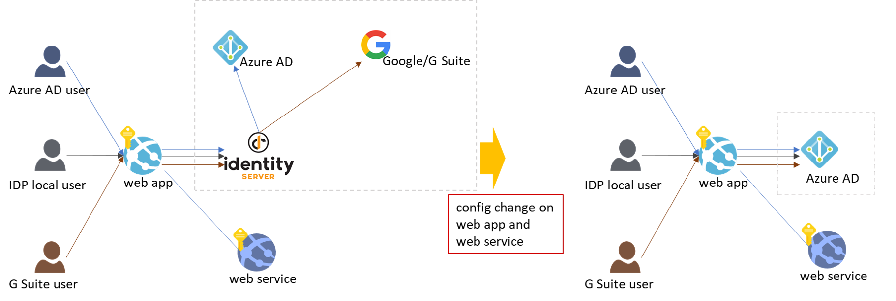
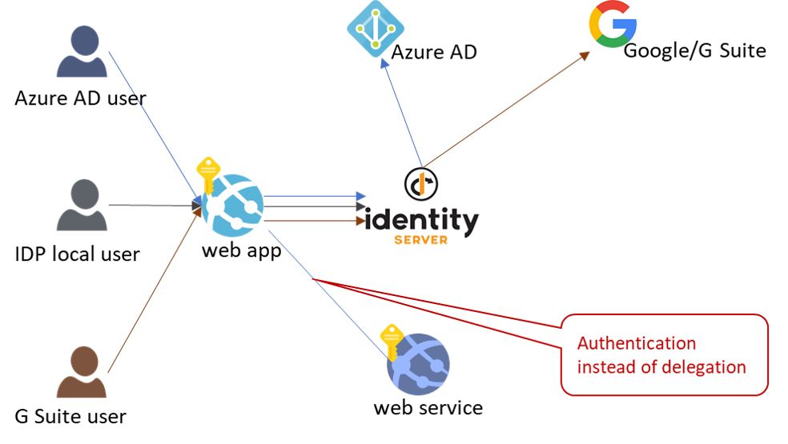
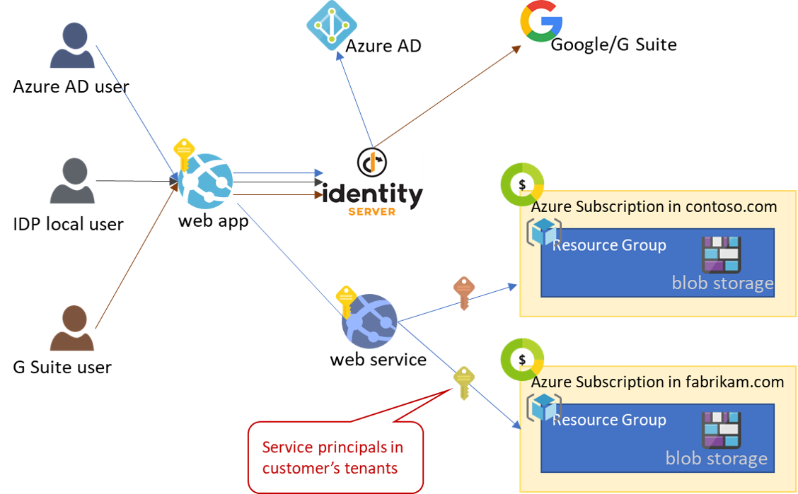
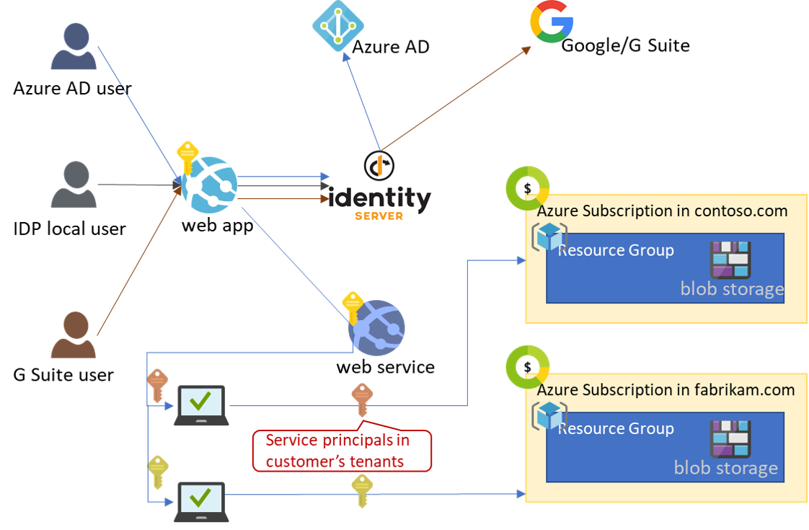
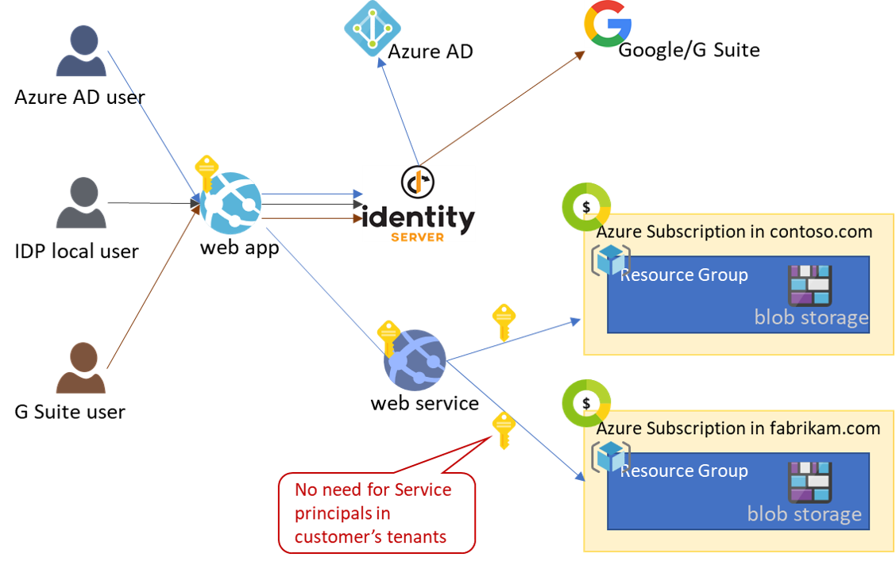
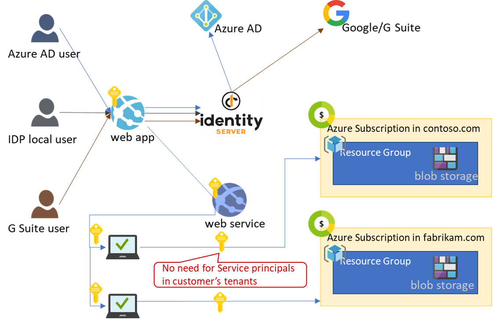

## Overview
This sample demonstrates the following scenarios:

1. Users authenticated with different OAuth2/OpenID Connect providers can access my web app with their existing identities.


2. With a configuration change, not code change, I can switch my web api to use a different OAuth2/OpenID Connect provider.



    Note that in this scenario, the web api is protected by requiring a user to authenticate, but not requring the user to consent for the web app to access the api on their behalf. This is the case where the web app and the web api all belong to the same company, there's no need for the user to delegate to the web app to access the api. 



3. My web app can access Azure blob storage in multiple Azure AD tenants using Service Principals in those tenants.



    My web app can generate a Shared Access Signature URL for client applications to access storage.



4. My web app can access Azure blob stroage in multiple Azure AD tenants using a Service Principal in my own tenant with Azure Lighthouse.



    My web app can generate a Shared Access Signature URL for client applications to access storage without creating service principals in customer's tenants.



The majority of the code in this sample is based on [IdentityServer4 Quickstart Tutorial](https://identityserver4.readthedocs.io/en/latest/quickstarts/0_overview.html). You can write an identity provider (IDP) to achieve the authentication scenarios yourself. In fact, [ASP.NET core middleware](https://docs.microsoft.com/en-us/aspnet/core/security/authentication/?view=aspnetcore-3.1) has great support for OAuth2 and OpenID Connect. However, IdentityServer4 is an OpenSource framework that already implements these protocols.

## Getting Started
There are 3 projects in this repo:
* a sample web client app in the [MvcClient](MvcClient) folder
* a sample web api in the [BackendSvc](BackendSvc) folder
* a web app that runs IdentityServer4 in the [IdentityServer](IdentityServer) folder

The code in the repo is fully functional. You can clone and run them in localhost, with ports configured in each project's ```launchSettings.json```. However, there are a lot settings in each project's ```appsettings.json``` that you must configure for your environments, for example, tenant ids, subscription ids, service principals, and storage accounts. You must also register your applications in Azure AD and Google. 

There's also an instance deployed in Azure, using [Github actions in this repo](.github/workflows/cicd.yml), that you can try without having to configure anything yourself: 
* sample web client app: https://polyauthfrontend.azurewebsites.net
* sample web api: https://polyauthbackend.azurewebsites.net
* web app that runs IdentityServer4: https://polyauthserver.azurewebsites.net

If you want to set up the solution from scratch, here are the main steps: 
1. [Register an application in Azure AD](https://docs.microsoft.com/en-us/azure/active-directory/develop/quickstart-register-app). Only registered apps can sign in a user in Azure AD.
2. [Register an application in Google](https://developers.google.com/identity/sign-in/web/sign-in). 
3. Follow [this IdentityServer4 tutorial](https://identityserver4.readthedocs.io/en/latest/quickstarts/2_interactive_aspnetcore.html#interactive-applications-with-asp-net-core) to set up and customize your ASP.NET Core client application with IdentityServer4.
4. [Add Azure AD as an external provider to the web app](IdentityServer/Startup.cs#L55)
5. [Add Demo IdentityServer4 as an external provider to the web app](IdentityServer/Startup.cs#L86)
6. [Add custom or non-standard scopes](IdentityServer/Config.cs#L22) that a client can [request](IdentityServer/Config.cs#L56).
7. Implement [web api](BackendSvc/BlobstoreController.cs#L31) to access Azure Blob Storage.
8. Follow this [Azure Lighthouse documentation](https://docs.microsoft.com/en-us/azure/lighthouse/how-to/onboard-customer) to deploy a storage account in another tenant. 
9. Implement [web api](BackendSvc/BlobstoreController.cs#L51) to access Azure Blob Storage in the target tenant you deployed with Azure Lighthouse.

## Test the scenarios
1. TODO
2. TODO
3. TODO
4. TODO


