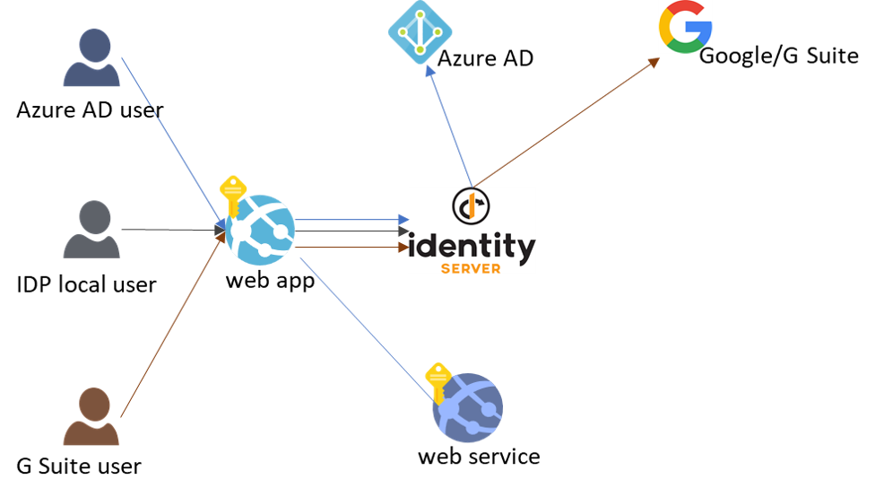

## Overview
This sample demonstrates the following scenarios:

1. Users authenticated with different OAuth2/OpenID Connect providers can access my web app with their existing identities.



2. With a configuration change, not code change, I can switch my web api to use a different OAuth2/OpenID Connect provider.


>Note that in this scenario, the web api is protected by requiring a user to authenticate, but not requring the user to consent for the web app to access the api on their behalf. This is the case where the web app and the web api all belong to the same company, there's no need for the user to delegate to the web app to access the api. 


3. My web app can access Azure blob storage in multiple Azure AD tenants using Service Principals in those tenants.


>My web app can generate a Shared Access Signature URL for client applications to access storage.


4. My web app can access Azure blob stroage in multiple Azure AD tenants using a Service Principal in my own tenant with Azure Lighthouse.


>My web app can generate a Shared Access Signature URL for client applications to access storage without creating service principals in customer's tenants.


The majority of the code in this sample is based on [IdentityServer4 Quickstart Tutorial](https://identityserver4.readthedocs.io/en/latest/quickstarts/0_overview.html). You can write an identity provider (IDP) to achieve the authentication scenarios yourself. In fact, [ASP.NET core middleware](https://docs.microsoft.com/en-us/aspnet/core/security/authentication/?view=aspnetcore-3.1) has great support for OAuth2 and OpenID Connect. However, IdentityServer4 is an OpenSource framework that already implements these protocols.

## Try it out
There's an instance of this solution deployed in Azure, using [Github actions in this repo](.github/workflows/cicd.yml), that you can try without having to configure anything yourself: 
* sample web client app: https://polyauthfrontend.azurewebsites.net using IdentityServer to federate against multiple external providers.
  * another instance of the client app: https://polyauthfrontendaad.azurewebsites.net using Azure AD as the identity provider.
  * another instance of the client app: https://polyauthfrontendgoogle.azurewebsites.net using Google as the identity provider.
* sample web api: https://polyauthbackend.azurewebsites.net.
* web app that runs IdentityServer4: https://polyauthserver.azurewebsites.net.

## Test the scenarios
1. Go to https://polyauthfrontend.azurewebsites.net, 
    * log in as zoe/zoe, then log out
    * log in using an Azure AD account, then log out
    * log in using a Google account, then log out (note that you need to log out of the client app, but also go to google to logout)
    * log in to the Demo IdentityServer as bob/bob, then log out
2. Go to https://polyauthfrontendaad.azurewebsites.net, login button will lead you directly to Azure AD.
    * similarly, https://polyauthfrontendgoogle.azurewebsites.net, login button will lead you directly to Google.
    * These are different instances of the same frontend application, the only difference is in [MvcClient/appsettings.json](MvcClient/appsettings.json), ```AuthProvider``` is configured to go to ```myidsrv``` vs ```aad``` vs ```google```.
    * Click on ```CallBackendSvcSP``` to make a backend call from https://polyauthfrontend.azurewebsites.net and https://polyauthfrontendaad.azurewebsites.net respectively. This works because BackendSvc is configured to trust the IdentityServer and Azure AD, as seen in [BackendSvc/appsettings.json](BackendSvc/appsettings.json) ```TrustedAuthProviders```. Examine [how the BackendSvc verifies the __issuer__ and __audience__ of the Authorization token](BackendSvc/Startup.cs#L27) without any code specific to each identity provider. 
3. Go to https://polyauthfrontend.azurewebsites.net,
    * log in using an Azure AD account, then ```CallBackendSvcSP```, you'll see a list of blobs prefixed with *curve_*. The last item in the list is a SAS url to the last blob on the list that you can use to directly access in the browser.
    * log out and log in using IdentityServer or Google, you'll see a different list of blobs. 
    * examine how BackendSvc is [configured](BackendSvc/appsettings.json#L33) to use __different Service Principals__ to access different Storage accounts based on the identity provider user signed in with. 
4. Go to https://polyauthfrontend.azurewebsites.net,
    * log in using an Azure AD account, then ```CallBackendSvc```, you'll see a list of blobs. The last item in the list is a SAS url to the last blob on the list that you can use to directly access in the browser.  
    * log out and log in using IdentityServer or Google, you'll see a different list of blobs. 
    * examine how BackendSvc is [configured](BackendSvc/appsettings.json#L14) to use a __single Service Principal__ to access different Storage accounts in different Azure AD tenants, based on the identity provider user signed in with. 

## Run it yourself
There are 3 projects in this repo:
* a sample web client app in the [MvcClient](MvcClient) folder
* a sample web api in the [BackendSvc](BackendSvc) folder
* a web app that runs IdentityServer4 in the [IdentityServer](IdentityServer) folder

The code in the repo is fully functional. You can clone and run them in localhost, with ports configured in each project's ```launchSettings.json```. However, there are a lot settings in each project's ```appsettings.json``` that you must configure for your environments, for example, tenant ids, subscription ids, service principals, and storage accounts. You must also register your applications in Azure AD and Google. 

If you want to set up the solution from scratch, here are the main steps: 
1. [Register an application in Azure AD](https://docs.microsoft.com/en-us/azure/active-directory/develop/quickstart-register-app). Only registered apps can sign in a user in Azure AD.
    *  make sure to set ```accessTokenAcceptedVersion``` to 2 in the manifest if you want to use Azure AD v2 tokens.
    *  for a Azure AD multi-tenant application, follow [this guideline](https://docs.microsoft.com/en-us/azure/architecture/multitenant-identity/claims#issuer-validation) to validate issuer. In this sample, we don't restrict the tenants who can sign in. 
2. [Register an application in Google](https://developers.google.com/identity/sign-in/web/sign-in). 
3. Follow [this IdentityServer4 tutorial](https://identityserver4.readthedocs.io/en/latest/quickstarts/2_interactive_aspnetcore.html#interactive-applications-with-asp-net-core) to set up and customize your ASP.NET Core client application with IdentityServer4.
4. [Add Azure AD as an external provider to the web app](IdentityServer/Startup.cs#L55)
5. [Add Demo IdentityServer4 as an external provider to the web app](IdentityServer/Startup.cs#L86)
6. [Add custom or non-standard scopes](IdentityServer/Config.cs#L22) that a client can [request](IdentityServer/Config.cs#L56).
7. Implement [web api](BackendSvc/BlobstoreController.cs#L31) to access Azure Blob Storage.
8. Follow this [Azure Lighthouse documentation](https://docs.microsoft.com/en-us/azure/lighthouse/how-to/onboard-customer) to deploy a storage account in another tenant. 
9. Implement [web api](BackendSvc/BlobstoreController.cs#L51) to access Azure Blob Storage in the target tenant you deployed with Azure Lighthouse.
